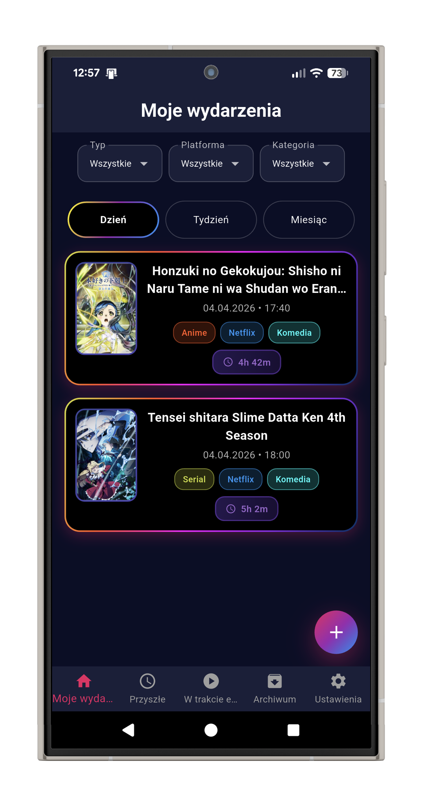
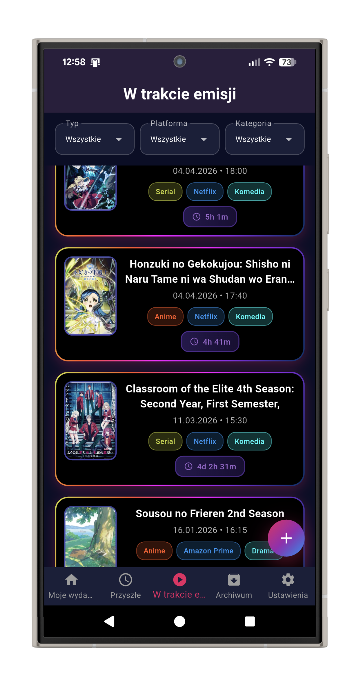
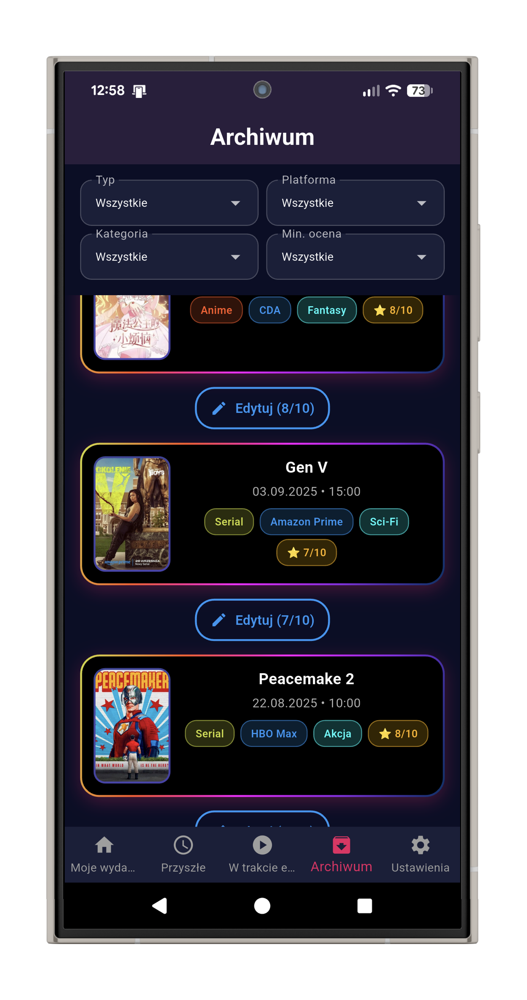
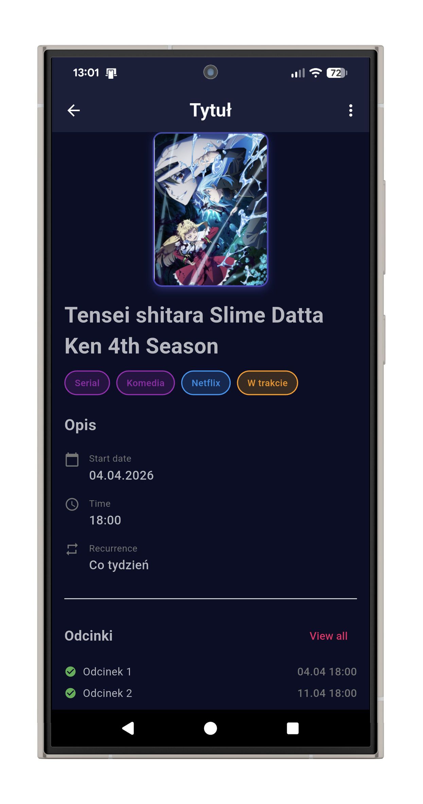

# NextDrop

Aplikacja mobilna do śledzenia cyklicznych wydarzeń medialnych: seriali, anime, podcastów, programów TV i filmów. Pozwala zaplanować harmonogram odcinków, otrzymywać powiadomienia o premierach i archiwizować ukończone pozycje wraz z oceną.

## Zrzuty ekranu

<!-- Wrzuć screeny do folderu screenshots/ i podmień ścieżki poniżej -->

  
  
  
  

## Funkcje

- Pięć typów wydarzeń: serial, anime, podcast, program TV, film
- Siedem wzorców cykliczności: jednorazowy, dzienny, tygodniowy, dwutygodniowy, miesięczny, niestandardowy interwał, pakietowy
- Automatyczny generator harmonogramu odcinków na podstawie wybranego wzorca
- Lokalne powiadomienia z obsługą stref czasowych, sześć trybów wyprzedzenia od 15 minut do 2 dni
- Trzy statusy wydarzeń: nadchodzące, w trakcie, zarchiwizowane, z automatycznym przejściem między nimi
- Automatyczna archiwizacja zakończonych pozycji oraz opcjonalna ocena 1-10
- Postponowanie odcinków z automatycznym przesunięciem kolejnych
- Filtrowanie po typie, platformie, kategorii i minimalnej ocenie
- Trzy widoki czasowe: dzień, tydzień, miesiąc
- Pełna wielojęzyczność (polski i angielski) z możliwością przełączenia w trakcie pracy
- Automatyczne dzienne kopie zapasowe bazy danych
- Obsługa zdjęć okładkowych z galerii urządzenia

## Stack techniczny

- **Framework:** Flutter 3.35+, Dart 3.9+
- **State management:** Riverpod 2.6
- **Baza danych:** SQLite (sqflite) z systemem migracji
- **Powiadomienia:** flutter_local_notifications + timezone
- **Lokalizacja:** flutter_intl, intl_utils
- **Uprawnienia:** permission_handler
- **Persystencja ustawień:** shared_preferences

## Architektura

Projekt zorganizowany w trzech warstwach zgodnie z zasadami clean architecture:

\`\`\`
lib/
├── core/             # Stałe, enumy, serwisy (powiadomienia, backup, walidacja)
├── data/             # Repozytoria, źródła danych, modele DB
│   ├── datasources/  # SQLite, SharedPreferences
│   ├── models/       # Modele warstwy danych
│   └── repositories/ # Implementacje repozytoriów
├── domain/           # Logika biznesowa (encje, abstrakcje repozytoriów)
└── presentation/     # UI: ekrany, widgety, providery Riverpoda
\`\`\`

Warstwy są oddzielone, zależności idą tylko w jedną stronę (presentation w stronę domain, data w stronę domain), co ułatwia testowanie i wprowadzanie zmian.

## Uruchomienie lokalne

\`\`\`bash
git clone https://github.com/Marioo990/NextDrop
cd NextDrop
flutter pub get
flutter run
\`\`\`

## Status projektu

Aplikacja jest sprawnym prototypem rozwijanym jako projekt portfolio. Wszystkie kluczowe funkcje działają. Planowane rozszerzenia: integracja z zewnętrznym API filmowym (np. TMDB), synchronizacja w chmurze, eksport danych do CSV.

## O projekcie

Aplikację zaprojektowałem i zrealizowałem samodzielnie. Przy implementacji korzystałem z narzędzi AI jako wsparcia w kodowaniu. Decyzje dotyczące architektury, modelu danych i logiki biznesowej podejmowałem samodzielnie.
